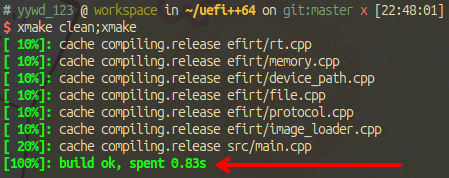

# UEFI++64

## 简介
这是一个轻量的,易于部署的,为amd64架构设计的uefi开发框架

## 注意
- 本项目依赖[xmake构建系统](https://xmake.io "xmake官方网站"),请自行安装
- 编译仅支持x86_64架构的linux工具链,如有需要请使用交叉编译器构建项目

## 使用
1. 在src目录下编写源码
2. 在项目根目录运行`xmake`即可编译,efi文件将会在`build`文件夹内生成